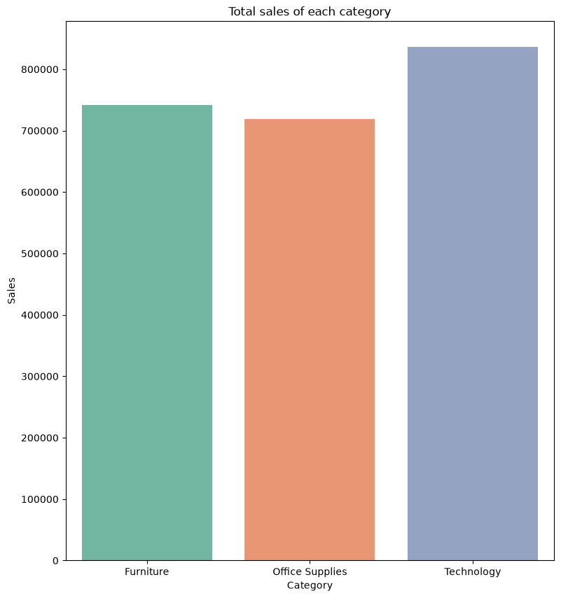
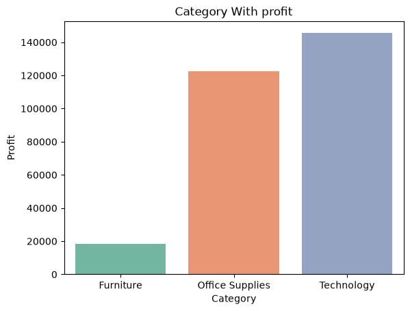
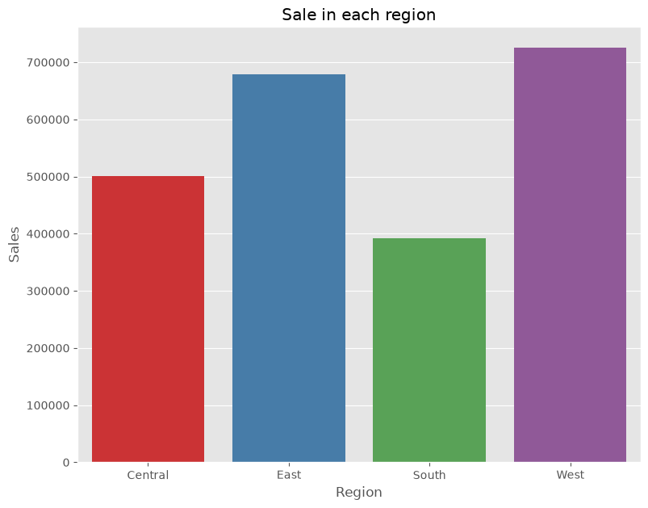
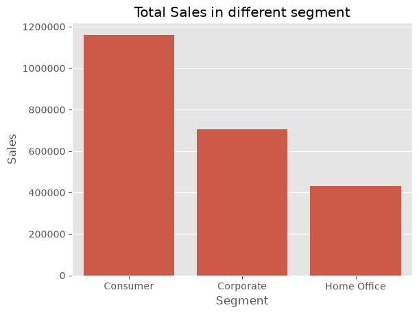
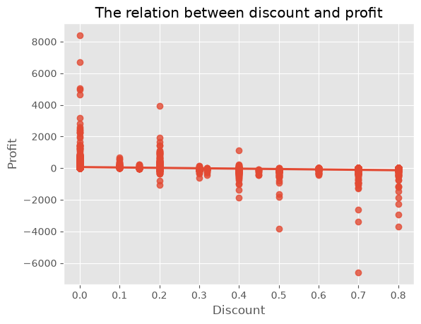
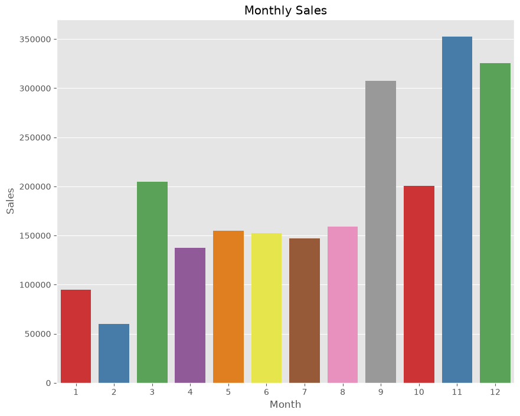
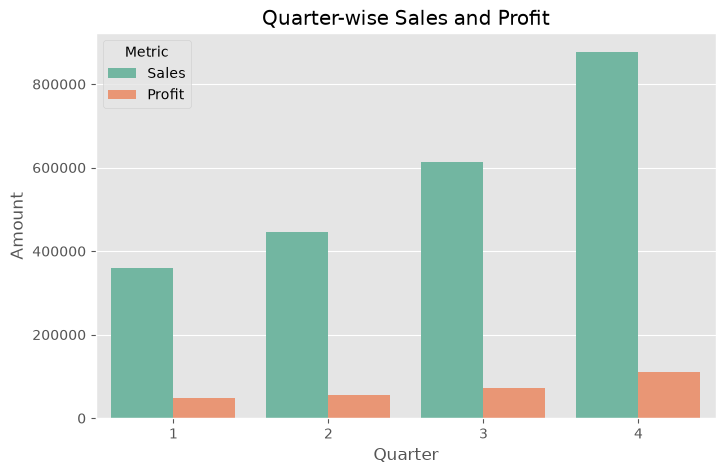

# E-Commerce Sales & Customer Analytics

End-to-end exploratory data analysis of an e-commerce transactional dataset, uncovering business insights around product performance, regional sales, customer segments, discount impact, and sales trends using Python.

## Business Problem

The analysis answers five key business questions:

1. Which product categories and sub-categories contribute the highest sales and profit?
2. Which regions and states perform well or underperform?
3. Which customer segments generate the highest revenue?
4. How do discounts impact profitability?
5. How do sales and profits change over time?

## Dataset

The dataset contains 9,994 transactional records from a superstore-style e-commerce business, including customer details, product categories, sales, profit, discounts, shipping information, and geographic location.

- **Source file:** `E-commerce_data.csv`
- **Processed file:** `ecommerce_feature_engineered.csv` (cleaned + engineered)

## Tools & Libraries

- Python
- Pandas, NumPy
- Matplotlib, Seaborn
- Jupyter Notebook

## Project Structure

```
├── 01_Project_Overview.ipynb        # Business problem, objectives, dataset familiarization
├── 02_Data_Preprocessing.ipynb      # Cleaning, type conversion, feature engineering
├── 03_EDA.ipynb                     # Full exploratory analysis & business insights
├── E-commerce_data.csv              # Raw dataset
├── ecommerce_feature_engineered.csv # Cleaned dataset with engineered features
├── images/                          # Exported chart images used in this README
│   ├── category_profit.png
│   ├── category_sales.png
│   ├── discount_vs_profit.png
│   ├── monthly_sales_trend.png
│   ├── quarterly_performance.png
│   ├── regional_sales.png
│   └── segment_sales.png
├── requirement.txt
├── .gitignore
└── README.md
```

> Note: a local `.venv/` virtual environment folder is used for development but is excluded from the repo via `.gitignore` — it should never be pushed to GitHub.

## Approach

1. **Project Overview** – defined the business problem, objectives, and explored dataset structure.
2. **Data Preprocessing** – checked for nulls and duplicates, converted date fields, engineered `Year`, `Month`, and `Quarter` features from `Order Date`, and saved a clean dataset for analysis.
3. **Exploratory Data Analysis** – analyzed the data across five business objectives (product, region, customer segment, discount, and time trends), with each finding backed by an **Observation → Insight → Recommendation** framework, plus a correlation analysis and a top-customer breakdown.

## Key Visualizations

**Category Performance — Sales vs Profit**

Technology leads on both sales and profit, while Office Supplies edges out Furniture on profit despite lower sales — a sign Furniture carries thinner margins.




**Regional Sales**

West and East regions outperform Central and South.



**Customer Segment Sales**

Consumer is the dominant segment by a wide margin.



**Discount vs Profit**

Profit variance shrinks and skews negative as discount increases — high discounts are strongly associated with losses.



**Monthly Sales Trend**

Sales are highly seasonal, peaking in November and December.



**Quarterly Sales & Profit**

Both sales and profit grow steadily through the year, peaking in Q4.



## Key Insights

- **Technology** is the strongest category by both sales and profit; **Furniture** sells well but has thin margins.
- **Tables** (sub-category) operate at a net loss despite steady sales — a candidate for pricing or discount review.
- The **West** region leads in sales and profit; the **South** trails in sales and **Central** in profit.
- The **Consumer** segment drives the largest share of both sales and profit.
- Higher discounts are associated with lower profit (correlation of **-0.22** between Discount and Profit), while discount has almost no relationship with Sales (**-0.03**) — discounting isn't lifting revenue, it's compressing margin.
- Sales and profit both grew consistently from 2014 to 2017, with **Q4** (especially November and December) consistently the strongest period of the year.
- A small group of customers (e.g., Tamara Chand, Raymond Buch, Sanjit Chand) rank highly on both sales and profit, while the top customer by sales volume doesn't appear in the top 10 by profit — a sign of over-discounting on high-volume accounts.

## How to Run

1. Clone the repository
2. Create a virtual environment (optional but recommended): `python -m venv .venv`
3. Install dependencies: `pip install -r requirement.txt`
4. Run the notebooks in order: `01_Project_Overview.ipynb` → `02_Data_Preprocessing.ipynb` → `03_EDA.ipynb`

## Author

**Syed Nadeemuddin**
[GitHub](https://github.com/syednadeemuddin44) | [LinkedIn](https://linkedin.com/in/nadeem2004)
